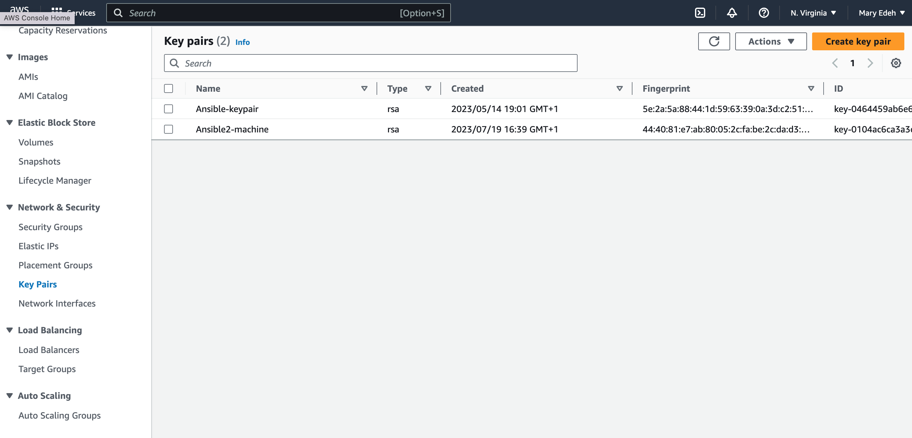

### Ansible Project.

***Use ansible to deploy a website to multiply instances.***
1.  First launch an EC2 instance/machine called ansible machine, then install Ansible on it.
2.  Create key pairs on the ansible machine and use the key pair to establish ssh connection between the ansible machine and the servers I want to configure.
3.  To establish an ssh connection, I will create a security group that allows ssh access between the ansible machine and the servers.
4.  Next, I will launch three(3) EC2 Instances.(the instance where I will configure ansible and install the website on.
5.  An Ansible playbook will be created on the ansible machine.
6.  Then I will create an Inventory file and configuration file.

## Steps involve in the project creation.
**1. Create security group(SG) for the ansible machine.**
   - In the management console type VPC, and select VPC under services. scroll 
      and select security group
   - Click the security group and give it a name [ansible_machine SG]
   - Give the SG a description name.
   - Select the default VPC.
   - The inbound rule will be 'ssh rule' and source to 'My IP'
   - Then select create security group.
     
     

     
     
**2. Create security group to add to webservers.**
   - In the management console type VPC, and select VPC under services. scroll 
      and select security group
   - Click the security group and give it a name [server SG]
   - Give the SG a description name.
   - Select the default VPC.
   - The inbound rule will be two(2) rules 1. 'HTTP' and source to 'anywhere IPv4', 2. 'ssh' and source 'ansible_machine sg'
   - Then select create security group.

     
     

     
     

     
     
 **3. Launch an EC2 Instance for ansible_machine.**
   -  In the management console type  'EC2', the select EC2.
   -  On the EC2 console select 'Launch instance'
   -  Name the Instance 'Ansible_machine'.
   -  The application and OS Images should be 'Amazon Linux'
   -  Under 'Amazon Machine Images (AMI) select 'Amazon Linux 2 AMI (HVM) which is a free tier eligible.
   -  Instance Type select 't2 micro' (free tier eligible).
   -  Choose a created keypair or create a new one to work with.
   -  Network setting: Edit { VPC (Default), Subnet (us east 1a), firewall (security group) (select 'existing security group' then select 
      'ansible_machine sg') }.
    
   

   

   

   

   

  **4.SSH into the EC2 Instance.** 
   - Select the created instance and click 'connect'.
   - Then follow the direction provided to ssh.
     
   

   

  **5. Create Key Pairs on the ansible-machine**
   - These will enable a connection between the ansible-machine and the other servers.
   - Steps: `ssh-keygen -t rsa -b 2048`
   - `pwd` -(to view present directory)
   - `cd .ssh` - (these command will enable us to enter the .ssh directory)
   - `ls` - (to all directory)
     
  
    
  **6. Import public key into the EC2 Instance**
   - Print the content of the public key. `cat id_rsa.pub`.
   - Select and copy the content.
   - Then move the management console and follow the below steps.
   - 'Network and Security'
   - 'key pair'
   - 'Action'
   - 'Import key pair'
   - Name the key pair and paste the copied content.

     

     
     
     
    
    

    
